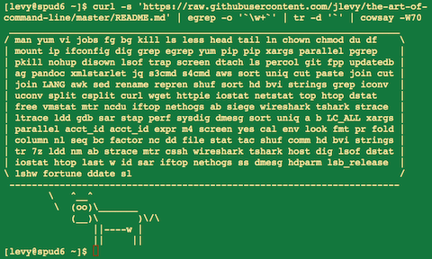

* 遇到的各种问题，欢迎PUSH到这里。

# 问题终结站

- [前言](#前言)
- [值得记住的问题](#值得记住的问题)
- [反复出错的问题](#反复出错的问题)
- [高明的技巧](#高明的技巧)

## 前言  
工作中每一个人都会遇到各种问题，有些问题很快就可以理解，有些很难理解，有些当时理解，一段时间后又不知道从何说起，这里将记录我们很长时间都无法理解的内容。

## 值得记住的问题
* [暂未开放]()

## 反复出错的问题
以出现问题的种类划分出错的问题，如`shell` `python` `scala` `java`。
* [Shell](Shell.md)
* [Python](Python.md)
* [Scala](Scala.md)
* [Java](Java.md)

## 高明的技巧
* [暂未开放]()

